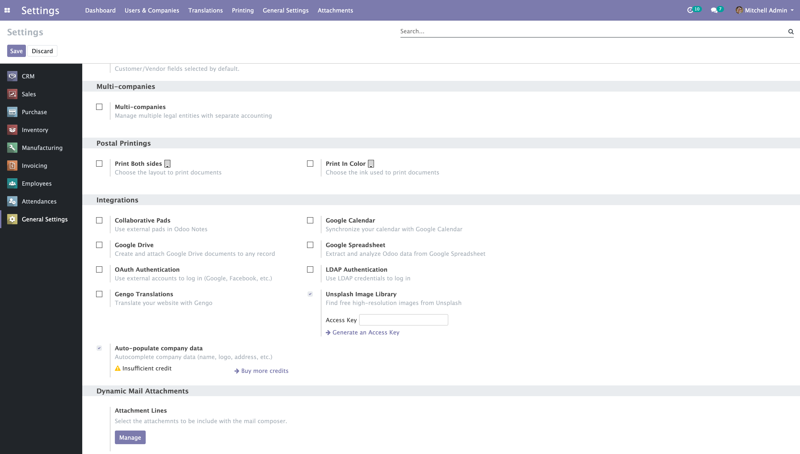
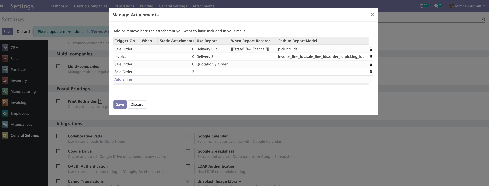
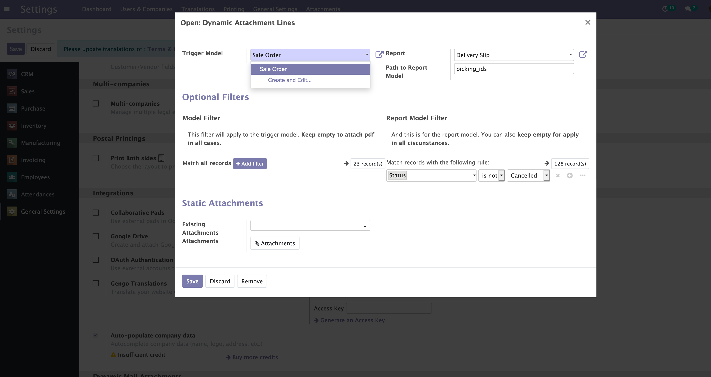

    <a href="https://www.odoo.com/documentation/12.0/index.html">
        </img>
    </a>
    <a href="http://www.alliantum.com">
        </img>
    </a>
    <a href="http://www.gnu.org/licenses/agpl-3.0-standalone.html">
        </img>
    </a>

    
    

        <h1>Dynamic Attachments to Mails</h1>
        Generate pdfs on the fly from odoo Reports, and decide based on conditions when to add them to your emails automatically.
        

    

## Installation

This module doesn't have any special dependencies. Just place it in your addons folder and install it.

## Usage

In order to add dynamically attachment to your emails. You must go to Settings / General Settings and scroll down to the bottom. A new seccion "Dynamic Mail Attachments" will have appeared there, then click on Manage button to lauch the wizard and start creating rules.

    

Start adding attachments is very easy, just click Add a line, then select the Model on which the current line will apply (for example, when sending an email from a Sale Order).

Then choose the Report to use, and the path to follow using dot notation, you can specify here the path (starting from Model) to the records that will be used by the Report.

For example:
 - Your rule applies to Sale Order, then if you want to attach the Delivery Slip to a Sale Order, you simply have to enter: 'picking_ids'
 - But, if your rule applies to Invoices for example, you will need maybe something like: 'invoice_line_ids.sale_line_ids.order_id.picking_ids'

    

Filtering is also available to decide in which circunstances our rule line will take action. If you just need to attach certain file for a Sale Order, which Customer has some special value in a concrete field, let's say, `partner_id.is_premium`, then you can use the button **Add Filter** to enter a domain that matchs your needs.

    

And finally, there's some extra options for attach static attachments. A couple of options are availables, one for add to you email attachments that are already loaded in Odoo, or to upload on the fly what you need.

## Credits

### Author

- Alliantum (www.alliantum.com)

### Contributors

- David Moreno <david.moreno@opensolutions.net>

